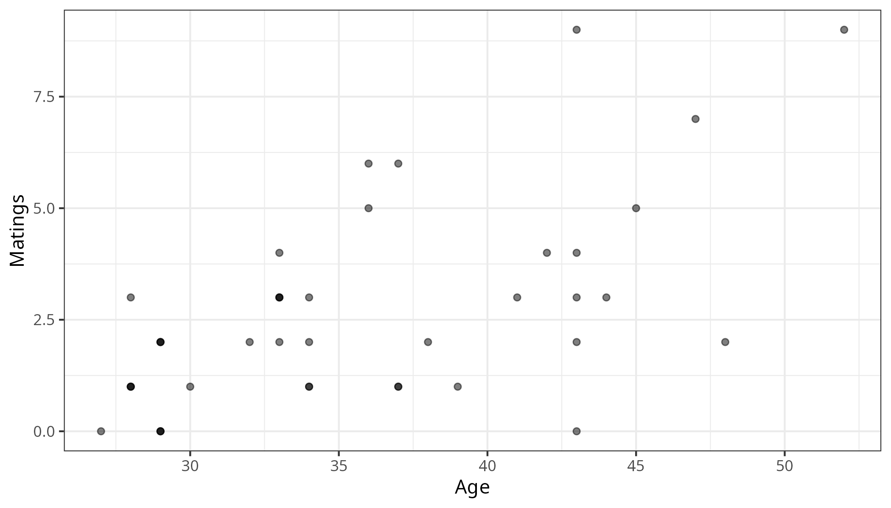

#+TITLE: Poisson GLM (Ch 22)
#+AUTHOR: STAT X12, Spring 2026
#+OPTIONS: toc:t num:nil
#+PROPERTY: header-args:R :session poisson-glm :results output :dir .

* Poisson Random Variables

\(Y \sim \text{Poisson}(\lambda)\)

- \(E[Y] = \lambda\)
- \(\text{Var}[Y] = \lambda\)
- \(Y\) = count per some unit of effort
- \(Y\) can take on values 0, 1, 2, 3, … (unbounded count)
- \(\lambda\) = mean count per unit effort in the population

#+begin_quote
*Note:* The Sleuth uses \(\mu_i\) instead of \(\lambda_i\), but \(\lambda_i\) is more typical.
#+end_quote

The Poisson PMF:

\[\Pr[Y = y] = \frac{e^{-\lambda} \lambda^y}{y!}, \quad y = 0, 1, 2, 3, 4, \ldots\]

[Poisson distribution plots omitted: shapes for \(\lambda\) = 0.5, 3, 6, 10, 30, illustrating how the distribution shifts right and becomes more symmetric as \(\lambda\) increases.]

** Examples

Identify the "count", "unit of effort", and the "sample unit" for the following Poisson RVs:

- \(Y\) = # of traffic accidents at an intersection over a year: [FILL IN]
- \(Y\) = # shrimp caught in 1-km tow of a net event: [FILL IN]
- \(Y\) = # of flaws on a computer chip: [FILL IN]

* Poisson GLM

** Elephant Case Study

Larger male elephants tend to be more successful in mating (can fight off smaller male elephants), and elephants grow throughout their lifetime. In a population of African elephants in Amboseli NP, Kenya, Joyce Pool collected data on 41 different male elephants.

- Age = age of elephant at the beginning of study
- Matings = total number of successful matings

Data are in =Sleuth3::case2201=.

#+begin_src R
library(tidyverse)
library(Sleuth3)
case2201 |>
  head(n = 10)
#+end_src

#+RESULTS:

#+begin_src R
p <- case2201 |>
  ggplot(aes(x = Age, y = Matings)) +
  geom_point(alpha = 0.5) + theme_bw()
suppressMessages(ggsave("poisson_glm_img/scatter_age_matings.png", plot = p, width = 7, height = 4))
#+end_src

#+RESULTS:

#+ATTR_HTML: :width 700

** Research Question

What is the relationship between mating success and age? Do males have diminished success after some optimal age?

Specify a model to address this RQ. Include distribution of \(Y\), linear predictor, and link function:

[FILL IN]

** Estimation

=glm= uses ML estimation to estimate \(\beta_0, \beta_1, \beta_2\).

#+begin_src R
fit_quad <- glm(Matings ~ poly(Age,2), data = case2201, family = "poisson")
summary(fit_quad)
#+end_src

#+RESULTS:

#+begin_example
Call:
glm(formula = Matings ~ poly(Age, 2), family = "poisson", data = case2201)

Coefficients:
              Estimate Std. Error z value Pr(>|z|)
(Intercept)     0.8759     0.1060   8.265  < 2e-16
poly(Age, 2)1   2.9690     0.6375   4.657 3.21e-06
poly(Age, 2)2  -0.2347     0.5495  -0.427    0.669

(Dispersion parameter for poisson family taken to be 1)

    Null deviance: 75.372  on 40  degrees of freedom
Residual deviance: 50.826  on 38  degrees of freedom
AIC: 158.27

Number of Fisher Scoring iterations: 5
#+end_example

** Estimated Model

#+begin_src R
summary(fit_quad)$coef
#+end_src

[FILL IN: Write out the estimated model on the log-count scale]

** Deviance GOF Test

Informal assessment of adequacy of model fit (same as Binomial GLM). \(H_0\): model is adequate vs. \(H_a\): model is inadequate.

- Deviance stat = Residual deviance, follows \(\sim \chi^2_{n-p}\) under \(H_0\)

#+begin_quote
*Caution:* This test is not trustworthy when Poisson means are small (< 5).
#+end_quote

Should we trust the \(\chi^2_{38}\) distribution as a reasonable approximation for the null distribution in this case?

#+begin_src R
fitted(fit_quad)
#+end_src

#+RESULTS:
#+begin_example
       1        2        3        4        5        6        7        8
1.205366 1.317143 1.317143 1.317143 1.317143 1.436813 1.436813 1.436813
       9       10       11       12       13       14       15       16
1.436813 1.436813 1.436813 1.564664 1.845963 1.999881 1.999881 1.999881
      17       18       19       20       21       22       23       24
1.999881 1.999881 2.162911 2.162911 2.162911 2.162911 2.516912 2.516912
      25       26       27       28       29       30       31       32
2.708089 2.708089 2.708089 2.908783 3.118983 3.567606 3.805739 4.052794
      33       34       35       36       37       38       39       40
4.052794 4.052794 4.052794 4.052794 4.308474 4.572418 5.123315 5.409210
      41
6.606923
#+end_example

[FILL IN: Are the fitted Poisson means large enough (> 5) to trust the \(\chi^2_{38}\) approximation?]

Generally, what does a large p-value from an omnibus GOF test mean? [FILL IN]

** Residuals

- *Deviance residuals:* measure of how different the max value of the log-likelihood is at observation \(i\) vs. the model-estimated value of the log-likelihood at observation \(i\) (see Sleuth for formula).
- *Pearson residuals:* observed response minus its estimated mean, divided by its estimated standard deviation.

Both are approximately \(N(0, 1)\) when \(\lambda\) is large enough.

** Residual Diagnostics

Note: we do not have large Poisson means in this example.

#+begin_src R
fit_quad <- glm(Matings ~ poly(Age,2), data = case2201, family = "poisson")
png("poisson_glm_img/diagnostics_quad.png", width = 1200, height = 400)
par(mfrow = c(1,4))
plot(fit_quad, pch = 20)
invisible(dev.off())
#+end_src

#+ATTR_HTML: :width 900
[[file:poisson_glm_img/diagnostics_quad.png]]

** Back to the RQ

Do males have diminished success after some optimal age?

#+begin_src R
round(summary(fit_quad)$coef, digits = 4)
#+end_src

#+RESULTS:
#+begin_example
              Estimate Std. Error z value Pr(>|z|)
(Intercept)     0.8759     0.1060  8.2647   0.0000
poly(Age, 2)1   2.9690     0.6375  4.6570   0.0000
poly(Age, 2)2  -0.2347     0.5495 -0.4271   0.6693
#+end_example

[FILL IN: Interpret the quadratic term result and state conclusion about diminished success]

** Refine Model

What is the relationship between mating success and age?

#+begin_src R
fit_linear <- glm(Matings ~ Age, data = case2201, family = "poisson")
summary(fit_linear)
#+end_src

#+RESULTS:
#+begin_example
Call:
glm(formula = Matings ~ Age, family = "poisson", data = case2201)

Coefficients:
            Estimate Std. Error z value Pr(>|z|)
(Intercept) -1.58201    0.54462  -2.905  0.00368
Age          0.06869    0.01375   4.997 5.81e-07

(Dispersion parameter for poisson family taken to be 1)

    Null deviance: 75.372  on 40  degrees of freedom
Residual deviance: 51.012  on 39  degrees of freedom
AIC: 156.46

Number of Fisher Scoring iterations: 5
#+end_example

** Summarise Inferential Model

1. Write the estimated model: [FILL IN]
2. Address the RQ by interpreting the estimate of the coefficient of interest and summarizing statistical findings on the original scale (include a test and CI). You can ignore overdispersion.
   - Construct a Wald-based 95% CI: [FILL IN]

* Quasipoisson for Overdispersion

\[\mu\{Y_i \mid X_i\} = \lambda_i \qquad \text{Var}\{Y_i \mid X_i\} = \psi^* \lambda_i\]

Which model should we use to estimate the degree of overdispersion in the elephant example — =fit_linear= or =fit_quad=? [FILL IN]

** Overdispersion Estimate

From =fit_quad=:

#+begin_example
Residual deviance: 50.826  on 38  degrees of freedom
#+end_example

\(\hat{\psi} =\) [FILL IN]

#+begin_src R
sum_pearson2 <- sum(resid(fit_quad, type = "pearson")^2)
psi_hat_star <- sum_pearson2/38
psi_hat_star
#+end_src

#+RESULTS:
#+begin_example
[1] 1.175194
#+end_example

\(\hat{\psi}^* = 1.175\)

** Checking for Overdispersion in General

1. Is extra Poisson variation likely?
2. Plot sample variance vs. sample mean for groups of responses with the same x values
3. Did deviance GOF from rich model result in evidence of lack-of-fit?
4. Conduct residual analysis

** Accounting for Overdispersion

Same as for Binomial GLM!
